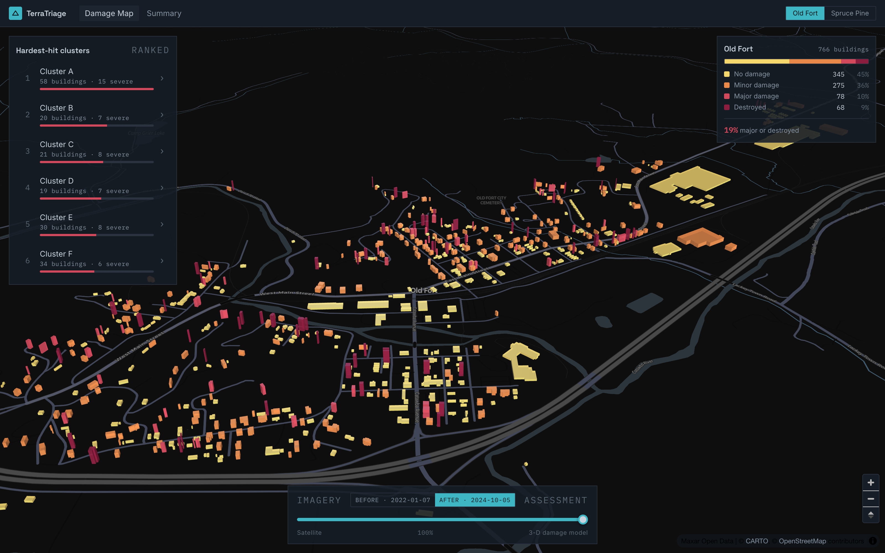
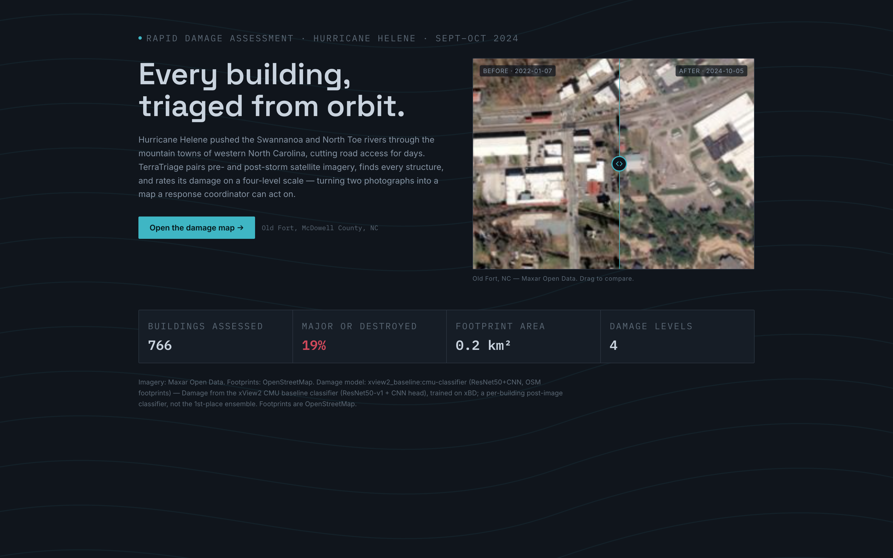

# TerraTriage

Disaster damage assessment from satellite imagery. Given **pre- and post-event
imagery** of an area, TerraTriage locates every building, rates its damage on
the four-level xView2 scale — **no damage → minor → major → destroyed** — fuses
two independent models into a per-building **confidence tier**, and puts the
result on an interactive 3-D map with a **human review queue** for the uncertain
calls. A separate **Live Monitor** tracks hazards happening right now (USGS
quakes, GDACS multi-hazard, NASA FIRMS fires) — explicitly *detection*, not
damage assessment.

Works for **any Maxar Open Data event**, chosen from an in-app event picker.
Ingested so far: **Hurricane Helene** (Old Fort & Spruce Pine, NC, Sept–Oct 2024)
and the **January 2025 LA Wildfires** (Pacific Palisades, CA).

|  |  |
|--|--|
|  |  |

## Layout

```
pipeline/   Python. event registry + imagery + footprints + fusion model -> GeoJSON
              events.py   Maxar Open Data event registry (list / summarise / match)
              fusion.py   dual-model -> per-building confidence tier
              poller.py   cron trigger: new imagery near a live hazard -> run pipeline
web/        React/TS. map app + Live Monitor + Review queue, reads the GeoJSON
docs/       PHASE_A_STATUS.md, PHASE_CD_STATUS.md
```

The two halves meet at one file: a GeoJSON `FeatureCollection` of building
polygons, each with a `damage_class` (0–3), lon/lat, and — schema **1.1** — a
`confidence_tier` (`high` / `review`), a `sources` dict (`{heuristic, cnn,
margin}`) and `footprint_source`. The collection carries a `review` roll-up. The
schema is `pipeline/src/terratriage/contract.py`, mirrored in
`web/src/lib/types.ts`. A second small file, `web/public/data/events.json`
(written by `run.py events registry`), is the offline event registry the picker
reads.

## Run it

### Pipeline (Phase A)

```bash
cd pipeline
python -m venv .venv && ./.venv/bin/pip install -r requirements.txt

# real xView2 CMU baseline classifier (recommended): one-time TF env
conda create -y -n terratriage-tf python=3.11
conda run -n terratriage-tf pip install "tensorflow==2.15.1" "numpy<2" pillow

# --- any event: same commands, only the flags change --------------------------
./.venv/bin/python scripts/run.py events list          # every Maxar Open Data event
./.venv/bin/python scripts/run.py fetch --event HurricaneHelene-Oct24 \
    --area old_fort --lat 35.6293 --lon -82.1804 --event-date 2024-09-26 \
    --name "Old Fort" --subtitle "McDowell County, NC"
./.venv/bin/python scripts/run.py infer --area old_fort        # backend=auto -> fusion
./.venv/bin/python scripts/make_tiles.py --area old_fort       # pre/post XYZ tiles for the app
./.venv/bin/python scripts/run.py validate --area old_fort     # -> data/output/old_fort_check.html

# LA wildfires — identical shape, different event
./.venv/bin/python scripts/run.py fetch --event WildFires-LosAngeles-Jan-2025 \
    --area palisades --lat 34.0834 --lon -118.5576 --event-date 2025-01-07 \
    --name "Pacific Palisades" --subtitle "Los Angeles, CA"
./.venv/bin/python scripts/run.py infer --area palisades
./.venv/bin/python scripts/make_tiles.py --area palisades

# write the web registries from every data/raw/*/meta.json
./.venv/bin/python scripts/run.py events registry     # -> web/public/data/events.json (ingested)
./.venv/bin/python scripts/run.py events catalog      # -> web/public/data/maxar_catalog.json (all 55)

# optional: API + on-demand assessment for any live disaster
./.venv/bin/pip install "fastapi" "uvicorn[standard]"
./.venv/bin/python server.py                          # http://127.0.0.1:8000
#   GET  /events/match         live USGS/GDACS hazards <-> Maxar catalogue
#   POST /assess {event,lat,lon,name}  -> fetch+infer+tiles+registry in the background
./.venv/bin/python scripts/run.py events match        # same, from the CLI

# optional: automated "new imagery near a live hazard" trigger
./.venv/bin/python scripts/poller.py --dry-run        # cron: */30 * * * * ... poller.py --run
```

Damage model: `--backend auto` picks **fusion** (xView2 CMU baseline CNN +
change-detection heuristic → per-building `confidence_tier`) when the CNN weights
and the `terratriage-tf` env are present, else `keras`, else `heuristic`. The
xView2 **1st-place** Siamese-U-Net ensemble is fully ported
(`src/terratriage/models/`, `run.py infer-seg --osm-filter`) and activates the
moment `xview2_1st_weights.zip` is dropped in `pipeline/weights/`.
See `docs/PHASE_A_STATUS.md` and `docs/PHASE_CD_STATUS.md`.

### App (Phase B)

```bash
cd web
npm install
npm run sync-data          # copy pipeline output into public/data/
npm run refresh-live       # seed public/data/live/*_snapshot.geojson (offline fallback)
npm run dev
```

`npm run build` → static `dist/`. No backend — the app reads the GeoJSON, the
event registry, the live snapshots and the tiles as static files.
`VITE_FIRMS_KEY=<key>` (a free NASA FIRMS map key) enables the active-fire layer.

## Demo flow

Landing → drag the before/after wipe → **Open the damage map** → drag the bottom
slider from *3-D damage model* to *Satellite* and back → click a ranked
"hardest-hit cluster" to fly there → hover / click a building → open **Review**,
approve or override a flagged building (watch it redraw on the map) → open
**Live monitor** for the global hazard picture → in **Assess a live hazard**,
pick a current disaster that has Maxar imagery and hit **Ingest** (with
`server.py` running) to build its damage map on the spot → **Event picker → LA
Wildfires** to see the same pipeline on a pre-baked second disaster → **Summary**
for the headline number.

## Credits & data

Imagery: [Maxar Open Data](https://www.maxar.com/open-data) via the
[opengeos/maxar-open-data](https://github.com/opengeos/maxar-open-data) STAC
mirror. Footprints: OpenStreetMap (ODbL). Model & code: xView2 baseline
(CMU SEI, BSD-3) and 1st-place solution (V. Durnov). Live hazards:
[USGS earthquakes](https://earthquake.usgs.gov/), [GDACS](https://www.gdacs.org/),
[NASA FIRMS](https://firms.modaps.eosdis.nasa.gov/). Radar extension point:
[Copernicus Sentinel-1](https://dataspace.copernicus.eu/). Multi-source-fusion +
human-review pattern after HOT's [fAIr](https://www.hotosm.org/). Basemap: CARTO.
Map: MapLibre GL + deck.gl.
